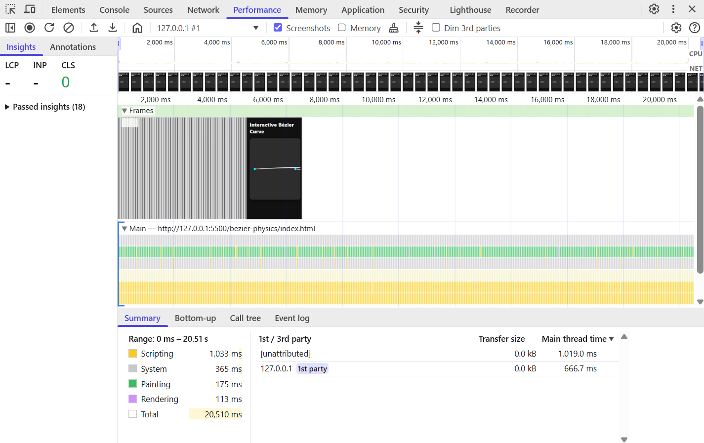

# Interactive Bézier Curve with Physics and Sensor Control

This project shows an interactive cubic Bézier curve using HTML, CSS, and JavaScript.  
The curve behaves like a spring rope and moves smoothly when you move the mouse or use device motion on iOS.

---

## Project Files

- `index.html` – structure and canvas setup  
- `style.css` – layout and design  
- `app.js` – Bézier curve, tangents, and physics logic  
- `demo.mp4` – 30 second demo video  
- `performance-timeline.png` – performance test result  
- `README.md` – explanation and results  
- `.gitignore` – ignored files for Git  
- `LICENSE` – MIT license

---

## Features

### Bézier Curve Formula

The cubic Bézier curve is calculated using this formula:

\[
B(t)=(1-t)^3P_0+3(1-t)^2tP_1+3(1-t)t^2P_2+t^3P_3
\]

Tangent (derivative):

\[
B'(t)=3(1-t)^2(P_1-P_0)+6(1-t)t(P_2-P_1)+3t^2(P_3-P_2)
\]

Tangents are shown along the curve to indicate direction.

---

### Physics and Motion

The control points move like springs using a simple damping model:

\[
a = k * (target - position) - c * velocity
\]

This produces a smooth, natural spring-like motion.

---

### Input and Control

- Works with mouse or pointer movement.  
- Supports gyroscope-based motion on iOS Safari.  
- Runs at around 60 FPS for smooth rendering.

---

## Results and Performance

### Demo Video (30 seconds)

Watch the live demo directly below:

<video width="700" controls>
  <source src="https://github.com/2004krishna/Interactive-B-zier-Curve-with-Physics-Sensor-Control-Solution/raw/main/demo.mp4" type="video/mp4">
  Your browser does not support the video tag.
</video>

---

### Performance Timeline

The Chrome DevTools performance test shows smooth animation with stable scripting, painting, and rendering.  
No frame drops or lag were observed.

---

## How to Run

1. Download or clone this repository.  
2. Open the folder in VS Code.  
3. Open `index.html` in Chrome or Safari.  
4. Move the mouse across the canvas to see the spring curve move.  
5. On iOS Safari, tap **Enable Motion (iOS)** to test gyroscope motion.

---

## Academic Integrity

All code in this project is original and written from scratch.  
No external libraries were used for Bézier or physics calculations.  
All formulas are standard mathematical equations shown above.

---

## Demo Checklist

- Show the page and curve loading.  
- Move the mouse to demonstrate smooth curve motion.  
- Show tangents and control point movement.  
- Record a short DevTools performance session.  
- Display project folder in VS Code.

---

